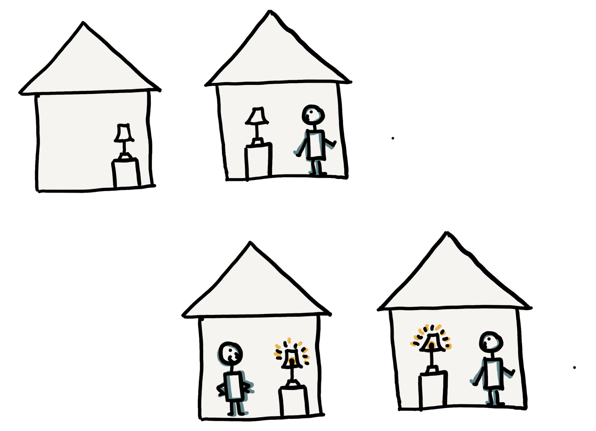

# loomi

loomi is a social computing experiment that consists of two IoT lamps that light up when both the owners are home.

It uses ESP8266 to connect the lamp to the internet, and Firebase + IFTTT to keep track of whether the lamp owners are home.
